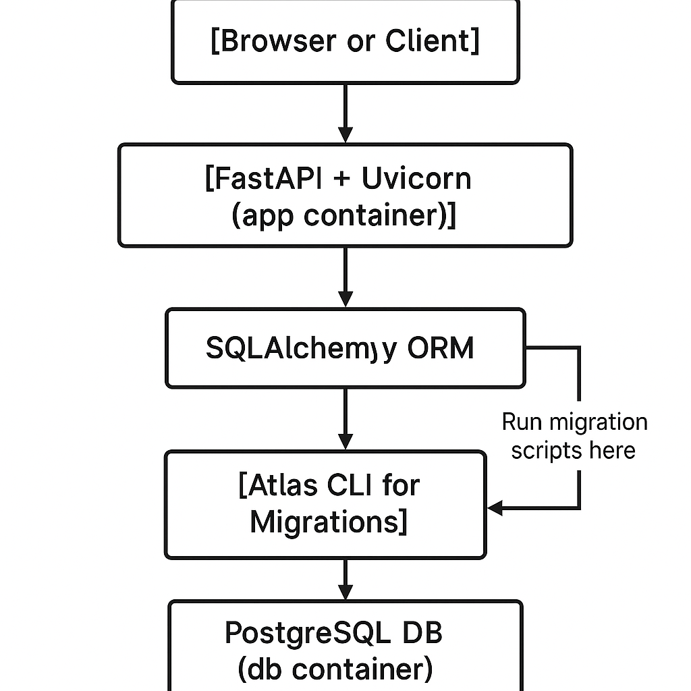

I am using conda to manage my python environment, and poetry to manage my python packages.
# Create a new conda environment
`conda create -n "sailraceiq" python=3.13`
# Activate the conda environment
`conda activate sailraceiq`

# Install poetry (if not already installed)
`pipx install poetry`

# Ensure poetry does not create a virtual environment inside the conda environment
#### This is important because we are using conda to manage the environment
`poetry config virtualenvs.create false`

# Install the dependencies
`poetry install`

# Start the docker container for Development
`docker compose -f compose.dev.yaml up`


# Server configuration

## tl;dr
```
[Browser or Client]
        │
        ▼
[FastAPI + Uvicorn (app container)]
        │
        ▼
[SQLAlchemy ORM]
        │
        ▼
[Atlas CLI for Migrations] ←────┐
        │                       │
        ▼                       │
[PostgreSQL DB (db container)] ◄─ Run migration scripts here
```



## Models
All models for the database are built using SQLAlchemy

## Migrations
We are using Atlas to manage our migrations

## Database 
For a dev environment, SQL alc